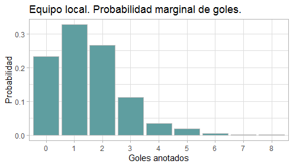
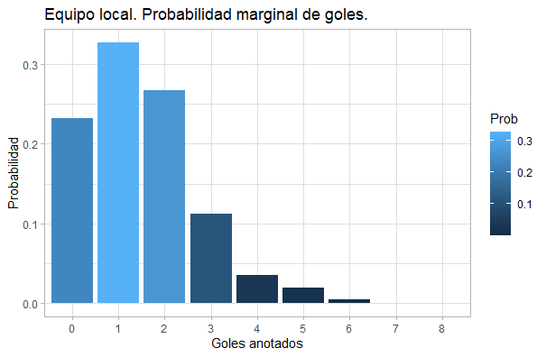
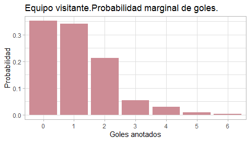
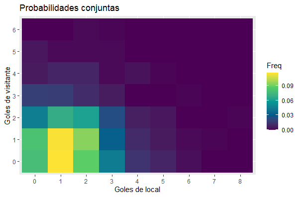

## Postwork Sesión 3. Análisis Exploratorio de Datos (AED o EDA) con R.

Desarrollo

Ahora graficaremos probabilidades (estimadas) marginales y conjuntas para el número de goles que anotan en un partido el equipo de casa o el equipo visitante.

  Con el último data frame obtenido en el postwork de la sesión 2, elabora tablas de frecuencias relativas para estimar las siguientes probabilidades:

    -La probabilidad (marginal) de que el equipo que juega en casa anote x goles (x=0,1,2,)

    -La probabilidad (marginal) de que el equipo que juega como visitante anote y goles (y=0,1,2,)

    -La probabilidad (conjunta) de que el equipo que juega en casa anote x goles y el equipo que juega como visitante anote y goles (x=0,1,2,, y=0,1,2,)

  Realiza lo siguiente:

   #### - Un gráfico de barras para las probabilidades marginales estimadas del número de goles que anota el equipo de casa.
   
   
   
   #### - Un gráfico de barras para las probabilidades marginales estimadas del número de goles que anota el equipo visitante.
   
   
   #### - Un HeatMap para las probabilidades conjuntas estimadas de los números de goles que anotan el equipo de casa y el equipo visitante en un partido.
   
   
### NOTA: En este caso de las segundas gráficas se realizaron con el objetivo de visualizar el gradiente de probabilidades reflejado en el gráfico de barras. En el caso del heatmap se escoge una paleta de colores nueva para lograr apreciar lo mejor posible las probabilidades más pequeñas.

El código utilizado es el siguiente:

```R
# Postwork Sesión 3. 

suppressWarnings(suppressMessages(library(dplyr)))
# Recordando el postwork de la sesión 2

fut.17_18 <- "https://www.football-data.co.uk/mmz4281/1718/SP1.csv"
fut.18_19 <- "https://www.football-data.co.uk/mmz4281/1819/SP1.csv"
fut.19_20 <- "https://www.football-data.co.uk/mmz4281/1920/SP1.csv"

Fut.1718 <- read.csv(fut.17_18)
Fut.1819 <- read.csv(fut.18_19)
Fut.1920 <- read.csv(fut.19_20)

flist <- list(Fut.1718,Fut.1819,Fut.1920)
list.f<- lapply(flist, select, Date, HomeTeam:FTR)

list.f[[1]] <- mutate(list.f[[1]], Date = as.Date(Date, "%d/%m/%y"))
list.f[[2]] <- mutate(list.f[[2]], Date = as.Date(Date, "%d/%m/%y"))
list.f[[3]] <- mutate(list.f[[3]], Date = as.Date(Date, "%d/%m/%y"))

df.f <- do.call(rbind, list.f)
l.df <- dim(df.f)[1] # Núm. de renglones tot. 

# 1. Con el último data frame obtenido en el postwork de la sesión 2, elabora tablas de frecuencias relativas para estimar las siguientes probabilidades:
#La probabilidad (marginal) de que el equipo que juega en casa anote x goles (x=0,1,2,)

#---- Sol. ----
#Para esto recordamos lo del prework 1 
f.loc  <- table(df.f$FTHG) # tabla local
prob.f <- prop.table(f.loc) # round(prop.table(f.loc),4) proba estimada
#(opcionealmente la probabilidad se puede calcular: round(f.loc/l.df,4))

# La probabilidad marginal de goles de local es:
prob.f

#---------------
#La probabilidad (marginal) de que el equipo que juega como visitante anote y goles (y=0,1,2,)
f.vis  <- table(df.f$FTAG)
prob.v <- prop.table(f.vis) # round(prop.table(f.vis),4) proba estimada 
#(opcionealmente la probabilidad se puede calcular: round(f.vis/l.df,4))

# La probabilidad marginal de goles de visitante es:
prob.v


#La probabilidad (conjunta) de que el equipo que juega en casa anote x goles y el equipo
#que juega como visitante anote y goles (x=0,1,2,, y=0,1,2,)


table.c <- xtabs(~FTHG+FTAG, df.f) # opcionalmente f.conj <- table(df.f$FTHG, df.f$FTAG)
proba.c <- table.c/l.df # opcionalmente (prop.table(table.c)) 
# proba estimada round(proba.c, 4)


#---------------------------------
#Realiza lo siguiente:
suppressWarnings(suppressMessages(library(ggplot2)))

##Un gráfico de barras para las probabilidades marginales estimadas del número de goles 
#que anota el equipo de casa

# Para ello tenemos que convertirlo a data frame 
df.local <- as.data.frame(prob.f)
str(df.local)

#Sabemos que el  nombre de Var 1 corresponde  a goles locales y Freq a la Probabilidad
# podemos cambiar los nombres como : 
df.local <- df.local %>% rename(loc.gol=Var1, Prob=Freq )

#Realizando la gráfica
graf.local <- ggplot(df.local, aes(x = loc.gol, y = Prob)) + 
  geom_bar (stat="identity", fill = 'cadetblue', colour="gray") +
  ggtitle('Equipo local. Probabilidad marginal de goles.')+
  xlab("Goles anotados")+
  ylab("Probabilidad")+
  theme_light()

graf.local

#más sofisticada en donde la intensidad del color denota qué tan alta es la probabilidad
local.graf <- ggplot(df.local, aes(x = loc.gol, y = Prob, fill= Prob)) + 
  geom_bar (stat="identity") +
  ggtitle('Equipo local. Probabilidad marginal de goles.')+
  xlab("Goles anotados")+
  ylab("Probabilidad")+
  theme_light()

local.graf


# If you want the heights of the bars to represent values in the data,
## use stat="identity" and map a value to the y aesthetic.

##Un gráfico de barras para las probabilidades marginales estimadas del número de goles 
#que anota el equipo visitante.
df.vis <- as.data.frame(prob.v)
str(df.vis)


# DE manera análoga a los goles locales 
df.vis <- df.vis %>% rename(goles.vis = Var1, Prob = Freq )

vis.graf <- ggplot(df.vis, aes(x = goles.vis, y = Prob)) + 
  geom_bar (stat="identity", fill = 'lightpink3') +
  ggtitle('Equipo visitante.Probabilidad marginal de goles.')+
  xlab("Goles anotados")+
  ylab("Probabilidad")+
  theme_light()

vis.graf

#más sofisticada en donde la intensidad del color denota qué tan alta es la probabilidad
graf.vis <- ggplot(df.vis, aes(x = goles.vis, y = Prob, fill= Prob)) + 
  geom_bar (stat="identity") +
  ggtitle('Equipo visitante. Probabilidad marginal de goles.')+
  xlab("Goles anotados")+
  ylab("Probabilidad")+
  scale_fill_gradient(low="yellow",high="red" )+
  theme_light()

graf.vis


##Un HeatMap para las probabilidades conjuntas estimadas de los números de goles
#que anotan el equipo de casa y el equipo visitante en un partido.

install.packages("reshape2") #esto es para poder utilizar melt
suppressWarnings(suppressMessages(library(reshape2)))

#proba.c <- melt(proba.c)
#melt: Convert an object into a molten data frame.Esto para poder utilizar los datos en el heatmap

df.pc <- as.data.frame(proba.c) #también lo podemos realizar directamente con el data frame 
names(df.pc)

df.c <- rename(df.pc, gol.loc = FTHG, gol.vis = FTAG, Proba = Freq)
heatmap <- df.pc %>% ggplot(aes(FTHG, FTAG, fill = Freq)) +
  geom_tile()+
  ggtitle('Probabilidades conjuntas ') +
  xlab("Goles de local")+
  ylab("Goles de visitante")+
  scale_fill_gradientn(colours = hcl.colors(5))
  #scale_fill_gradient(low = 'snow2', high = 'midnightblue')  
  #theme(axis.text.x = element_text(angle = 90, hjust = 0)) #con esto rotamos las etiquetas de goles del eje x (0,1,2,3,4,5,6,7,8)
heatmap

#Otra forma de visualizarlo
heatmap2 <- df.pc %>% ggplot(aes(FTHG, FTAG, fill = Freq)) +
  geom_tile()+
  ggtitle('Probabilidades conjuntas ') +
  xlab("Goles de local")+
  ylab("Goles de visitante")+
  scale_fill_gradient(low = 'snow2', high = 'midnightblue')  
#theme(axis.text.x = element_text(angle = 90, hjust = 0)) #con esto rotamos las etiquetas de goles del eje x (0,1,2,3,4,5,6,7,8)
heatmap2
```
