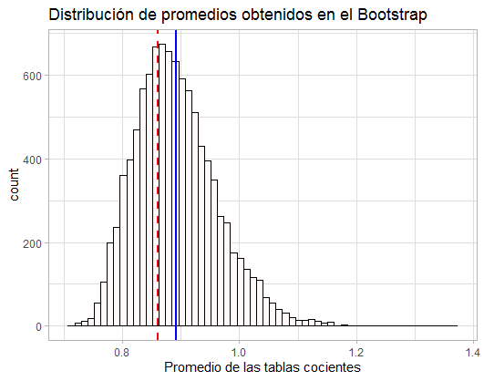

## Postwork Sesión 4. Algunas distribuciones, teorema central del límite y contraste de hipótesis

Desarrollo

Ahora investigarás la dependencia o independencia del número de goles anotados por el equipo de casa y el número de goles anotados por el equipo visitante mediante un procedimiento denominado bootstrap, revisa bibliografía en internet para que tengas nociones de este desarrollo.

 1.Ya hemos estimado las probabilidades conjuntas de que el equipo de casa anote X=x goles (x=0,1,... ,8), y el equipo visitante anote Y=y goles (y=0,1,... ,6), en un partido. Obtén una tabla de cocientes al dividir estas probabilidades conjuntas por el producto de las probabilidades marginales correspondientes.

 2. Mediante un procedimiento de boostrap, obtén más cocientes similares a los obtenidos en la tabla del punto anterior. Esto para tener una idea de las distribuciones de la cual vienen los cocientes en la tabla anterior. Menciona en cuáles casos le parece razonable suponer que los cocientes de la tabla en el punto 1, son iguales a 1 (en tal caso tendríamos independencia de las variables aleatorias X y Y).

Obtenemos la siguiente distribución mediante el procedimiento bootstrap: 



Con lo que concluimos que  con la gráfica de la distribución podemos concluir que en la mayoría de los casos
no sería válido concluir independencia de las variables aleatorias, esto por que los cocientes están,
en promedio en 0.8595706 que es menor a 1. Solamente unos cuantos (la menor parte) datos caen en 1. 
Por lo que las variables aleatorias X y Y son dependientes. 

```R
#Postwork 4. Algunas distribuciones, teorema central del límite y contraste de hipótesis.  

#Cargando las librerias necesiarias
suppressWarnings(suppressMessages(library(dplyr)))
suppressWarnings(suppressMessages(library(reshape2)))
suppressWarnings(suppressMessages(library(ggplot2)))
suppressWarnings(suppressMessages(library(plyr))) 

#Del postwork de la sesión 3 
#Obtenemos los url
fut.17_18 <- "https://www.football-data.co.uk/mmz4281/1718/SP1.csv"
fut.18_19 <- "https://www.football-data.co.uk/mmz4281/1819/SP1.csv"
fut.19_20 <- "https://www.football-data.co.uk/mmz4281/1920/SP1.csv"

#Importamos a R
Fut.1718 <- read.csv(fut.17_18)
Fut.1819 <- read.csv(fut.18_19)
Fut.1920 <- read.csv(fut.19_20)
#Creamos una lista que contenga los archivos y con lapply seleccionamos las columnas deseadas
flist <- list(Fut.1718,Fut.1819,Fut.1920)
list.f<- lapply(flist, select, Date, HomeTeam:FTR)

#Cambiamos el tipo de dato Date para que R lo tome en formato de fecha 
list.f[[1]] <- mutate(list.f[[1]], Date = as.Date(Date, "%d/%m/%y"))
list.f[[2]] <- mutate(list.f[[2]], Date = as.Date(Date, "%d/%m/%y"))
list.f[[3]] <- mutate(list.f[[3]], Date = as.Date(Date, "%d/%m/%y"))

#Combinamos los dataframe por renglones en un solo dataframe 
df.f <- do.call(rbind, list.f)
l.df <- dim(df.f)[1] # Núm. de renglones tot. del df  
str(df.f)


#Utilizamos las columnas FTAG (gol visitante) y FTHG (gol local)

f.loc  <- table(df.f$FTHG) # tabla local
prob.f <- prop.table(f.loc) # round(prop.table(f.loc),4) proba estimada
#(opcionealmente la probabilidad se puede calcular: round(f.loc/l.df,4))
# esta es la probilidad marginal de goles como local. 

#Análogamente,

f.vis  <- table(df.f$FTAG)
prob.v <- prop.table(f.vis) # round(prop.table(f.vis),4) proba estimada 
#(opcionealmente la probabilidad se puede calcular: round(f.vis/l.df,4))
# esta es la probilidad marginal de goles como visitante. 

table.c <- xtabs(~FTHG+FTAG, df.f)   # opcionalmente f.conj <- table(df.f$FTHG, df.f$FTAG)
proba.c <- table.c/l.df # opcionalmente (prop.table(table.c)) 
# proba estimada round(proba.c, 4), proba.c es la probabilidad conjunta 


#----------------------------

#1. Obtén una tabla de cocientes al dividir estas probabilidades conjuntas
#por el producto de las probabilidades marginales correspondientes.

#......Sol........
# proba.c es una matriz de probabilidades conjuntas 
proba.c
str(proba.c)
#Con proba.c[1,] obtenemos la primer fila, i.e.todas las prob.conjuntas de anotar gol de visitante si de local no 
# anotó ningún gol  y proba.c[,1] da la primer columna, i.e. si de visitante no anotó, da la proba. conjunta de anotar
# como local (0,1,2,3,4,5,6,7,8) goles.
#Las columnas de la matriz corresponden a FTAG (gol visitante) y las filas a FTHG (gol local),
#con apply escogemos si aplicamos a las filas o columnas (filas (1) y columnas (2)). 

#Como buscamos dividir entre el producto de los valores de las tablas de las probabilidades marginales, i.e.
#entrada a entrada de la matriz conjunta tenemos p.e. proba.c[1] / (prob.f[1]*prob.v[1]).Hay que notar que
#las dimensiones de local y visitante no son las mismas, ya que para local se tienen (0,1,2,3,4,5,6,7,8) i.e.
#dim(prob.f) = 9 y para visitante (0,1,2,3,4,5,6) i.e. dim(prob.v) = 7. 

#Además la matriz conjunta cuenta sus entradas por renglón, así, la entrada proba.c[10] corresponde a la 
#probabilidad conjuta de gol local = 0 (FTHG=0) y gol visitante = 1 (FTAG =1), para calcular esa entrada
#tendíamos : proba.c[10]/(prob.f[1]*prob.v[2]).

#Con esto nos damos cuenta que necesitamos distinguir entre renglones y columnas. Para ello creamos 
#una función que divida las columnas entre la proba marginal y otra para las filas.  

col <- function(columna) columna/prob.f #cada columna tiene las probas de gol local
fil <- function(fila)    fila/prob.v    #cada fila tiene las probas de gol visitante

(t.loc.conj <- apply(proba.c, 2,col)) #tabla de local conjunta aplicando la función a todas las col. de la matriz

(table.coc <- apply(t.loc.conj, 1,fil)) #aplicando la función a las filas 

(t.coc <- t(table.coc)) #Es necesario obtener la transpuesta ya que al aplicar apply con filas se transpone la matriz
# Es además claro si observamos las etiquetas FTAG y FTHG en la matriz

# podemos comprobar que sea correcto con un valor conocido como lo es proba.c[10]/(prob.f[1]*prob.v[2]).


#-------- La tabla de cocientes es:
t.coc 


#2. Mediante un procedimiento de boostrap, obtén más cocientes similares a los obtenidos 
#en la tabla del punto anterior. Esto para tener una idea de las distribuciones de la cual
#vienen los cocientes en la tabla anterior. Menciona en cuáles casos le parece razonable 
#suponer que los cocientes de la tabla en el punto 1, son iguales a 1
#(en tal caso tendríamos independencia de las variables aleatorias X y Y).

# El procedimiento boostrap consiste en Replicación: en lugar de tomar muchas muestras de la población, obtener réplicas 
#(muestras con reemplazamiento) de la muestra original. Todas las réplicas deben tener el mismo tamaño que la muestra original: n.

#La distribución bootstrap del estadístico se obtiene a partir de estas muestras y sirve para 
#estimar la distribución del estadístico.


#Cargamos las librerías que podemos necesitar 
install.packages("rsample")
library(rsample)
library(boot)
suppressWarnings(suppressMessages(library(tidyverse)))

r <- reshape2::melt(t.coc) #recordando que melt se utilizó en el postwork pasado para poder utilizar los datos 


mean(t.coc) #0.8595706 es el promedio de la tabla de cocientes con la base de datos : df.f completa

# El procedimiento de bootstrap se puede realizar con las funciones bootstraps de la paquetería rsample
set.seed(10) # Semilla para replicar el proceso 
muestras_boot <- bootstraps(r,times = 100,replace="TRUE")
muestras_boot

#lo que sucede es que se genera un dataframe con dos columnas: un id y los "splits" para cada bootstrapeo con un df a su vez
library(magrittr) #Esto incluye el operados %$% 
m1 <- muestras_boot %>% 
  filter(id=="Bootstrap001") %$%
  splits[[1]][[1]]

#En este se muestran los valores generados en el primer ciclo 

data.frame(table(muestras_boot %>% 
                   filter(id=="Bootstrap001") %$%
                   splits[[1]][[2]])) %>% 
  arrange(-Freq)

#En este data frame, como hay repetición , se muestra que existe una probabilidad de elegir más de una vez la misma muestra.
#Por ello la frecuencia es mayor a 1 en algunos casos 


#Outer Product of Arrays (outer())
#Description
#The outer product of the arrays X and Y is the array A with dimension c(dim(X), dim(Y))

#Es conveniente crear una función en la cual se genere la muestra y se realice la estadística
boot <- function(){
 
  muestra <- sample_n(df.f, size = dim(df.f)[1], replace = T) #muestra del mismo tamaño que el df original
  conjunta <- prop.table(xtabs(~FTHG+FTAG, muestra) ) #tabla de proba conjunta de FTHG gol local y FTAG gol visitante
  cociente <- conjunta / outer(rowSums(conjunta), colSums(conjunta)) #Se obtiene la tabla de cocientes usando el atajo de cálculo outer() para 
  #los productos de las probas marginales
  return(cociente)
}
set.seed(1700)
resultado <- replicate(10000, boot(), simplify = F) #En esta parte se realiza el "loop", esto es las replicas de la función

promedios <- c() #vector vacío inicial

#Calculamos los promedios de los cocientes de las tablas generadas en el bootstrap
for(i in 1:10000){
  promedios[i] = mean(resultado[[i]])
}

#Realizamos la gráfica de las distribución obtenida 
grafica <- ggplot() + 
  geom_histogram(bins = 60,color="black",fill="snow") + 
  aes(promedios)+
  geom_vline(xintercept = mean(promedios),color="blue",size=1) +
  geom_vline(xintercept = mean(t.coc),color="red",linetype = "dashed",size=1) +
  ggtitle('Distribución de promedios obtenidos en el Bootstrap') +
  xlab("Promedio de las tablas cocientes") +
theme_light()

grafica 

mean(promedios) #0.8914363 promedio de los cocientes generados en el bootstrap (línea azul)
mean(t.coc) #  0.8595706 promedio de los cocientes del df completo

#De tal forma que con la gráfica de la distribución podemos concluir que en la mayoría de los casos
#no sería válido concluir independencia de las variables aleatorias, esto por que los cocientes están,
#en promedio en 0.8595706 que es menor a 1. Solamente unos cuantos (la menor parte) datos caen en 1. 
#Por lo que las variables aleatorias X y Y son dependientes. 
```
