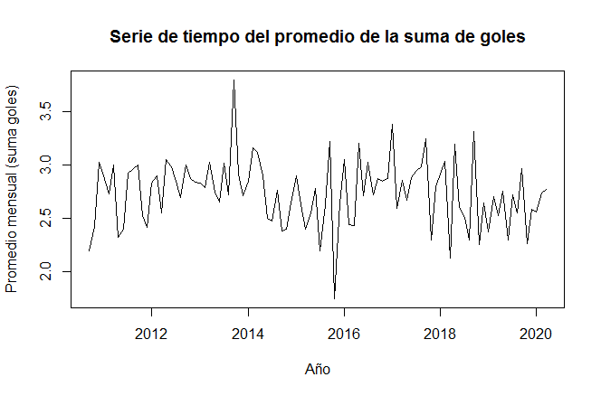

## Postwork Sesión 6. Series de tiempo.

Desarrollo

Importa el conjunto de datos match.data.csv a R y realiza lo siguiente:

    1.Agrega una nueva columna sumagoles que contenga la suma de goles por partido.

    2.Obtén el promedio por mes de la suma de goles.

    3.Crea la serie de tiempo del promedio por mes de la suma de goles hasta diciembre de 2019.

    4.Grafica la serie de tiempo.

Del resultado del códigi obtenemos la siguiente serie de tiempo para los goles hasta diciembre de 2019:


El código es el siguiente:
```R
#Postwork 6. Series de tiempo.

#Cargando las librerias necesiarias
suppressWarnings(suppressMessages(library(dplyr)))
suppressWarnings(suppressMessages(library(ggplot2)))
suppressWarnings(suppressMessages(library(plyr))) 


#Importa el conjunto de datos match.data.csv a R y realiza lo siguiente:

#Importando march.data.csv

match.url <- 'https://raw.githubusercontent.com/beduExpert/Programacion-con-R-Santander/master/Sesion-06/Postwork/match.data.csv'


#El archivo se puede descargar o leer directamente de la url para importarlo a R
# Al descargarlo tenemos que estar en el directorio de trabajo deseado 
setwd("C:/Users/Carolina/Desktop/Postwork/Sesión 6")

download.file(url = match.url, destfile = "match.data.csv", mode = "wb")
match.data <- read.csv("match.data.csv") #Leyendo el archivo .csv
str(match.data) ; head(match.data)

#1. Agrega una nueva columna sumagoles que contenga la suma de goles por partido.

#Para agregar una nueva col. utilizamos mutate

match.data <- mutate(match.data, sumagoles = home.score + away.score)
head(match.data)


#2. Obtén el promedio por mes de la suma de goles.

#De match.data podemos observar que la columna date es de tipo caracter, para hacer operaciones tiene que estar 
#en formato de fecha y-m-d, para ello utilizaremos mutate y as.Date

match.data <- mutate(match.data, date = as.Date(date, "%Y-%m-%d"))
str(match.data) ; head(match.data)

# Para obtener el promedio por mes tenemos que utilizar el dataframe anterior, agregar la columna que contenga mes
# y año para agrupar todos los partidos correspondientes a dicho mes,y una vez agrupados calcular el promedio


match.data <- mutate(match.data, mes = format.Date(date,"%Y-%m")) #agregamos la col. de mes
  

#Agrupamos por mes, calculamos el promedio creando la tabla mes-promedio
month.match <- ddply(match.data, .(mes) ,summarise, promedio= mean(sumagoles)) 

# ddply(): For each subset of a data frame, apply function then combine results into a data frame.
# summarise() creates a new data frame. It will have one (or more) rows for each combination of grouping variables.

#3. Crea la serie de tiempo del promedio por mes de la suma de goles hasta diciembre de 2019.

match.2019 <- filter(month.match, mes <= "2019-12") #delimitamos hasta dic. de 2019

ts.match <- ts(match.2019$promedio, start=c(2010,08),fr=10) #creamos la serie de tiempo

#En este caso la frecuencia es 10,por que no hay datos de los meses junio (06) y julio(07)
# otra forma de crear la serie de tiempo : t <- ts(match.2019$promedio,st=1,fr=10)

#4. Grafica la serie de tiempo.

ts.plot(ts.match, gpars = list(xlab ="Año", ylab = "Promedio mensual (suma goles)",main = "Serie de tiempo del promedio de la suma de goles"))
```
